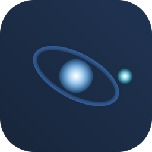

# NoOrbit

IDE nativa per a escriptori amb **agent IA local**, integracions reals amb **Blender** i **Unreal Engine 5**, suport per a **Android/iOS natius** (Kotlin+Compose, Swift+SwiftUI) amb emuladors, i un sistema obert d'**extensions**, **skills** i **MCP**.

Construïda amb [Tauri 2](https://tauri.app) + [React](https://react.dev) + [TypeScript](https://www.typescriptlang.org) + [Monaco Editor](https://microsoft.github.io/monaco-editor/). Lleugera, sense Electron.

<p align="center">
  
</p>

---

## Contents

- [Què és NoOrbit](#què-és-noorbit)
- [Novetats de la 0.6.0](#novetats-de-la-060)
- [Instal·lació (usuari final)](#instal·lació-usuari-final)
- [Compilar des del codi font](#compilar-des-del-codi-font)
- [On són els instal·ladors un cop compilats](#on-són-els-instal·ladors-un-cop-compilats)
- [Wiki](#wiki)
- [Arquitectura](#arquitectura)
- [Llicència](#llicència)

---

## Què és NoOrbit

| Àmbit | Què inclou |
|---|---|
| **Editor** | Monaco amb multi-cursor, Quick Open, Cerca global, Command Palette, pestanes, git diff integrat. |
| **Terminal** | PTY real multi-sessió connectat al backend Rust. |
| **IA** | Xat multi-sessió amb streaming en viu, **materialització automàtica** de fitxers mentre la IA encara està escrivint, i **reintents automàtics** si l'equip es queda sense memòria/context. |
| **Mòbil natiu** | Selector de plataforma per xat (escriptori / Android / iOS). Android: Kotlin + Jetpack Compose + Material 3. iOS: Swift + SwiftUI. Gestió d'AVDs i simuladors, *live view* amb captures periòdiques. |
| **Blender** | Add-on Python (`blender-scripts/noorbit_bridge.py`) + client socket. Executa scripts dins la sessió de Blender i llegeix l'escena. |
| **Unreal** | Remote Control API + bootstrap Python (`unreal-scripts/bootstrap.py`). Build, launcher i execució de scripts. |
| **Extensions** | Skills (carpetes amb `SKILL.md`), plugins natius i servidors **MCP**. |
| **Especialistes** | Rols amb model, temperatura i prompt propis per tasques concretes. |
| **i18n** | **Català com a idioma base**. Extensible amb fitxers JSON a `apps/desktop/src/i18n/locales/`. |

Tota la documentació ampliada és a la **wiki**: <https://github.com/jpuigbert/noorbit/wiki>

---

## Novetats de la 0.6.0

- **Navegador intern controlat per totes les IAs, sense botons**: qualsevol IA del xat (local, remota o experta) pot obrir pàgines, llegir-ne el contingut i consultar IAs web (DeepSeek, ChatGPT, Claude, Gemini, Perplexity, Grok…) escrivint directrius de text `NB|OBRIR|`, `NB|LLEGIR|`, `NB|PREGUNTA_IA|` que NoOrbit executa. Abans de preguntar a una IA web es demana **permís a l'usuari** i la finestra sempre és visible (el login el fa sempre la persona).
- **El codi dels xats web s'aprofita**: quan una IA web o una pàgina retorna codi, NoOrbit l'extreu en blocs estructurats (amb el llenguatge) i la IA local l'adapta i l'escriu al projecte com a fitxers reals (format `@file:` + automaterialització).
- **Imatges al xat**: es mostren en línia, es poden copiar al porta-retalls i adjuntar/enganxar (⌘V) com a entrada dels models amb visió.
- **Catàleg d'IAs** (menú IA): abans de descarregar veus la mida aproximada de cada model, si és sense censura, si té visió i si pot generar imatges o vídeo.
- **Generació i manipulació d'imatges**: amb ComfyUI local (si la RAM ho permet) o via API en línia amb la teua clau.
- **Orquestrador d'IAs externes legit**: descobriment d'instal·lacions locals (Ollama, LM Studio, llama.cpp…) i fallback en línia **només** amb tokens propis de l'usuari, etiquetant sempre l'origen de cada resposta.
- **Proveïdors d'API robustos**: claus normalitzades (espais, barras, URLs amb `/v1`…), Venice amb el model correcte (`venice-uncensored`) i migració automàtica de la configuració vella, errors 401/404/429 explicats en català.

---

## Instal·lació (usuari final)

### Descàrrega de binaris

Els instal·ladors publicats es troben a la secció **Releases** del repositori:

**👉 <https://github.com/jpuigbert/noorbit/releases>**

Cada release inclou, per a cada sistema, l'arxiu corresponent (substitueix la versió per l'última publicada):

| Sistema | Fitxer que has de descarregar |
|---|---|
| **macOS** (universal, recomanat: Intel + Apple Silicon) | `NoOrbit_0.6.0_universal.dmg` |
| **macOS** (Intel) | `NoOrbit_0.6.0_x64.dmg` |
| **macOS** (Apple Silicon) | `NoOrbit_0.6.0_aarch64.dmg` |
| **Windows** (10 / 11) | `NoOrbit_0.6.0_x64-setup.exe` |
| **Linux** (Debian / Ubuntu) | `NoOrbit_0.6.0_amd64.deb` |
| **Linux** (Fedora / RHEL) | `NoOrbit-0.6.0-1.x86_64.rpm` |
| **Linux** (universal) | `NoOrbit_0.6.0_amd64.AppImage` |

> **Versions anteriors**: cada tag és un release independent a GitHub i **no esborra mai** els de versions velles (p. ex. la 0.5.0 completa és a <https://github.com/jpuigbert/noorbit/releases/tag/v0.5.0>). L'índex automàtic de totes les versions i els seus enllaços és l'asset `versions.json` de l'últim release.

### Instruccions per sistema

**macOS — primera arrencada (app no signada)**

NoOrbit **no està signada amb Developer ID ni notaritzada** per Apple (això requereix un compte de desenvolupador de 99 $/any). macOS aplica *Gatekeeper* i bloqueja l'arrencada el primer cop. **No és un error de la app**: és el comportament esperat de qualsevol app descarregada d'Internet sense signar. Tens 3 manes d'activar-la, de més suau a més directa:

**Mètode 1 — Clic dret → Obre (el més recomanable)**
1. Obre el `.dmg` i arrossega **NoOrbit** a la carpeta **Aplicacions**.
2. Al **Finder**, ves a **Aplicacions**, fes **clic dret** (o `Control`+clic) sobre **NoOrbit.app** → **Obre**.
3. Apareixerà el diàleg *«No es pot verificar el desenvolupador»* — prem **Obre**.
4. **Només cal fer-ho un cop.** A partir d'ara, l'obriràs amb doble clic normal.

**Mètode 2 — Configuració del Sistema (si el clic dret no mostra el botó Obre)**
1. Fes doble clic a NoOrbit (refusarà obrir-la; és normal).
2. Obre **Configuració del Sistema → Privadesa i seguretat**.
3. Baixa fins a l'apartat **Seguretat**; hi apareixerà:
   *«S'ha bloquejat NoOrbit.app perquè prové d'un desenvolupador no identificat»* → prem **Obre de totes maneres**.
4. Escriu la contrasenya del Mac i confirma. Torna a obrir la app.

**Mètode 3 — Terminal (elimina l'atribut de quarantena)**
Si els dos mètodes anteriors no funcionen o vols automatitzar-ho:
```bash
xattr -dr com.apple.quarantine /Applications/NoOrbit.app
```
(No cal `sudo` si la app és a Aplicacions i la vas moure tu. Després obre NoOrbit normalment amb doble clic.)

> ⚠️ **Missatge «NoOrbit està malmès i no es pot obrir»**? Sembla alarmant però gairebé sempre significa una d'aquestes dues coses:
> - La descàrrega s'ha tallat a mitges → torna-la a descarregar i compara el SHA-256 amb l'asset del Release.
> - El `.dmg` s'ha obert des de la còpia temporal de Safari/Chrome sense moure la app a Aplicacions → mou **NoOrbit.app** a **Aplicacions** primer, i després aplica el Mètode 1 o el 3.

**Nota per a Apple Silicon (M1–M4)**: no cal cap pas addicional. El bloqueig és el mateix Gatekeeper que a Intel; l'arquitectura universal ja inclou el codi natiu arm64.

**Per què no es firma?** La signatura i notarització exigeixen un compte de desenvolupador d'Apple de pagament. Si vols una versió signada (sense bloquejos ni passos manuals), col·labora amb el projecte o crea un issue per prioritzar-ho: el workflow de CI ja prepara els binaris i només caldria afegir-hi els secrets `APPLE_SIGNING_IDENTITY`, `APPLE_ID` i `APPLE_APP_SPECIFIC_PASSWORD`.

**Windows**
1. Doble clic a `NoOrbit_0.6.0_x64-setup.exe`.
2. S'instal·la **per a l'usuari actual**, sense necessitat de drets d'administrador.
3. L'executable apareix al menú Inici.

**Linux (Debian/Ubuntu)**
```bash
sudo apt install ./NoOrbit_0.6.0_amd64.deb
# si el paquet ja està descarregat i vols instal·lar-lo "a la vella":
sudo dpkg -i NoOrbit_0.6.0_amd64.deb && sudo apt -f install
```
Executa'l amb `no-orbit` o des del menú d'aplicacions.

**Linux (Fedora/RHEL)**
```bash
sudo dnf install ./NoOrbit-0.6.0-1.x86_64.rpm
```

**Linux (AppImage)**
```bash
chmod +x NoOrbit_0.6.0_amd64.AppImage
./NoOrbit_0.6.0_amd64.AppImage
```

---

## Compilar des del codi font

### Requisits comuns (a totes les plataformes)

| Eina | Versió mínima | Com install·lar |
|------|----------------|-----------------|
| Node.js | 20 | <https://nodejs.org> |
| pnpm | 9 | `corepack enable` |
| Rust | 1.77 | <https://rustup.rs> |

**Dependències del sistema operatiu**:

- **macOS**: `xcode-select --install` (Command Line Tools).
- **Linux (Debian/Ubuntu)**:
  ```bash
  sudo apt update && sudo apt install -y \
    libwebkit2gtk-4.1-dev build-essential curl wget file \
    libxdo-dev libssl-dev libayatana-appindicator3-dev librsvg2-dev
  ```
- **Windows**: Microsoft **C++ Build Tools** (workload *Desktop development with C++*) + **WebView2 Runtime** (a Windows 11 ja ve inclòs; a Windows 10 es baixa sol gràcies a `webviewInstallMode: downloadBootstrapper`).

### Passos

```bash
git clone https://github.com/jpuigbert/noorbit.git
cd noorbit
pnpm install

# Mode desenvolupament (hot reload)
pnpm app:dev

# Compilar paquets segons el sistema:
pnpm app:build:mac:universal   # macOS: DMG universal (Intel + Apple Silicon)
pnpm app:build:mac:intel       # macOS: només Intel
pnpm app:build:mac:arm         # macOS: només Apple Silicon
pnpm app:build:deb             # Linux: .deb
pnpm app:build:linux           # Linux: .deb + .rpm + AppImage
pnpm app:build:win             # Windows: .exe (NSIS) + .msi
pnpm app:build                 # El paquet natiu del SO on s'està executant
```

> ⚠️ Cada instal·lador s'ha de **construir des del seu sistema operatiu** (o en CI). Des de macOS no es poden crear `.deb` de Linux ni `.exe` de Windows de forma fiable perquè enllacen biblioteques pròpies d'aquelles plataformes. El que sí es pot fer des d'un sol Mac és produir un **DMG universal** (Intel + Apple Silicon).

---

## On són els instal·ladors un cop compilats

Tots els paquets es generen a:

```
apps/desktop/src-tauri/target/[<triple>]/release/bundle/
```

Rutes completes segons sistema:

### macOS (des de macOS)

```
apps/desktop/src-tauri/target/universal-apple-darwin/release/bundle/
├── dmg/NoOrbit_0.6.0_universal.dmg      ← compartiu això
└── macos/NoOrbit.app                     ← app "nua" (provable directament)
```

Per a només Intel (`--target x86_64-apple-darwin`) o només Apple Silicon (`--target aarch64-apple-darwin`), substitueix `universal-apple-darwin` per l'altre triple.

### Windows (des de Windows)

```
apps\desktop\src-tauri\target\release\bundle\
├── nsis\NoOrbit_0.6.0_x64-setup.exe      ← instal·lador clàssic (recomanat)
└── msi\NoOrbit_0.6.0_x64_en-US.msi        ← paquet per a desplegaments empresarials (GPO/SCCM)
```

### Linux (des de Linux)

```
apps/desktop/src-tauri/target/release/bundle/
├── deb/NoOrbit_0.6.0_amd64.deb            ← Debian / Ubuntu
├── rpm/NoOrbit-0.6.0-1.x86_64.rpm         ← Fedora / RHEL
└── appimage/NoOrbit_0.6.0_amd64.AppImage  ← universal (tots els distros)
```

En una ARM Linux (p. ex. Raspberry Pi) afegeix `--target aarch64-unknown-linux-gnu` i ajusta el nom del paquet.

---

## Wiki

La documentació detallada (arquitectura, integracions, extensions, dreceres, guia de contribució) és a:

**📚 <https://github.com/jpuigbert/noorbit/wiki>**

Pàgines disponibles:

- [[Instalació]]
- [[Funcionalitats]]
- [[IA-en-NoOrbit]]
- [[Desenvolupament-mòbil-natiu]]
- [[Integració-Blender]]
- [[Integració-Unreal]]
- [[Extensions]]
- [[Dreceres-de-teclat]]
- [[Arquitectura]]
- [[Contribució]]

---

## Arquitectura

```
noorbit/
├── apps/desktop/                 ← única app (Tauri)
│   ├── src/                      ← frontend React/TypeScript (components/, stores/, i18n/, editor/, core/, help/)
│   ├── src-tauri/                ← backend Rust (commands/, ai/, agent/, mobile/, blender/, unreal/, experts/, plugins/, skills/, lsp/, computer/, autonomous/, api/)
│   └── package.json
├── blender-scripts/              ← add-on Python per connectar amb Blender
├── unreal-scripts/              ← bootstrap Python per Unreal
├── scripts/                      ← instal·ladors (install-unreal.sh)
└── tools/                        ← eines de build (make-icons.mjs)
```

Fluxos clau:

- **Streaming IA**: el backend emet l'event `ai://chunk` etiquetat per `sessionId`; el frontend (`agentStore.appendStream`) acumula el text i **crida `scheduleLiveMaterialize`** per escriure fitxers reals a disk **en viu**, mentre el model encara està generant.
- **Reintents automàtics**: si Ollama/LM Studio fallan per `out of memory` o el stream es talla, NoOrbit torna a intentar-ho automat­icament amb context **reduït → sense codi → sense historial**, sense intervenció humana.
- **Invoke**: comandaments Rust cridats des de TS via `invoke("name", { args })` de `@tauri-apps/api/core`.

---

## Llicència

Distribuïda sota **MIT** — veure [`LICENSE`](LICENSE) i [`NOTICE`](NOTICE).

Part del disseny i alguns fragments deriven o estan inspirats en **Visual Studio Code**, i utilitzen el **Monaco Editor**, ambdós llicenciats sota MIT per Microsoft Corporation. L'atribució completa és a `NOTICE`.

---

## Estat del projecte

Versió actual: **0.6.0**. El projecte està en desenvolupament actiu. Si trobes un bug o vols una funcionalitat, obre un [issue](https://github.com/jpuigbert/noorbit/issues).
